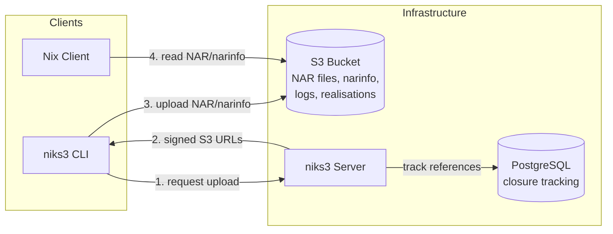

# S3-backed Nix binary cache with GC

The idea is to have all reads be handled by the s3 cache (which itself can be high-available)
and have a gc server that tracks all uploads to the cache and runs periodic GC on s3 cache.
Since writes to a binary cache are often not as critical as reads,
we can vastly simplify the operational complexity of the GC server, i.e. only
running one instance next to the CI infrastructure.

## Architecture



**Write path**: The niks3 CLI requests an upload from the server, which returns pre-signed S3 URLs.
The client uploads NAR files and narinfo directly to S3.
The server tracks references in PostgreSQL for garbage collection.

**Read path**: Nix clients read directly from S3 (or a CDN in front of it) without going through niks3.
This allows the read path to scale independently and remain highly available.

## Features

### Binary Cache Protocol Support

niks3 implements the [Nix binary cache specification](https://nixos.org/manual/nix/stable/command-ref/new-cli/nix3-help-stores.html#s3-binary-cache-store) with the following features:

- **NAR files** (`nar/`): Compressed with zstd, stored in S3
- **Narinfo files** (`.narinfo`): Metadata with cryptographic signatures
  - StorePath, URL, Compression, NarHash, NarSize
  - FileHash, FileSize (for compressed NAR)
  - References, Deriver
  - Signatures (Sig fields)
  - CA field for content-addressed derivations
- **Build logs** (`log/`): Compressed build output storage
- **Realisation files** (`realisations/*.doi`): For content-addressed derivations
- **Cache info** (`nix-cache-info`): Automatic generation with WantMassQuery, Priority

### Advanced Features

- **Cryptographic signing**: NAR signatures using Ed25519 keys (compatible with `nix key generate-secret`)
- **Content-addressed derivations**: Full CA support with realisation info
- **Multipart uploads**: Efficient handling of large NARs (>100MB)
- **Transactional uploads**: Atomic closure uploads with rollback on failure
- **Garbage collection**: Reference-tracking GC with configurable retention
- **Parallel uploads**: Client parallelizes NAR and metadata uploads

### Operational Features

- Authentication via API tokens (Bearer auth)

## S3 Provider Comparison

niks3 works with any S3-compatible storage provider, but different providers have varying characteristics that may affect your deployment:

| Provider | Performance | Content-Encoding | CDN | Storage | Egress/Bandwidth | Notes |
|----------|-------------|-----------------|-----|---------|------------------|-------|
| **Cloudflare R2** | ✅ Excellent | ✅ Native | ✅ Built-in | $0.015/GB | **$0/GB** (free!) | **Recommended**: Built-in CDN, zero egress fees, works out of the box. Free tier: 10GB storage, 10M reads, 1M writes/month. |
| **Backblaze B2** | ✅ Good | ⚠️ Workaround | ✅ Required | $0.006/GB | First 3× storage free, then $0.01/GB | Very affordable storage. Requires CDN (Fastly) for Content-Encoding headers. See [clan-infra config](https://git.clan.lol/clan/clan-infra/src/branch/main/modules/terranix/cache-new.nix). |
| **Hetzner Object Storage** | ❌ Poor | ✅ Native | ⚠️ Doesn't help | €4.99/mo (1TB) | 1TB included, then €1.00/TB | **Not recommended**: 10s+ response times for `.narinfo` lookups persist even with CDN. |
| **AWS S3** | ✅ Excellent | ✅ Native | ❌ Optional | $0.023/GB | $0.09/GB | Enterprise-grade, extensive features. Higher egress costs make it expensive for binary caches. Can use CloudFront CDN. |

### Pricing Analysis for Binary Cache Workloads

Binary caches are **read-heavy** with significant download traffic. For a typical scenario (1TB storage + 10TB downloads/month):

- **Cloudflare R2**: $15/month (storage only, zero egress fees)
- **Backblaze B2**: $76/month ($6 storage + $70 egress beyond 3TB free allowance)
- **AWS S3 (direct)**: $923/month ($23 storage + $900 egress to internet)
- **AWS S3 + CloudFront**: $873/month ($23 storage + $0 S3→CloudFront transfer + $850 CloudFront egress)
- **Hetzner**: €14/month (~$15/month, but poor performance makes it unsuitable)

**Note**: AWS S3 transfers to CloudFront (and other AWS services in the same region) are free, but CloudFront still charges $0.085/GB for egress to the internet, only marginally cheaper than direct S3 egress.

**Winner**: Cloudflare R2 and Hetzner offer ~98% cost savings vs AWS S3. However, Hetzner's poor performance (10s+ latency) makes Cloudflare R2 the clear choice, combining excellent performance with the lowest viable cost.

### Content-Encoding Requirements

Nix binary caches compress files with zstd (`.narinfo`, `.nar.zst`, `.ls`, build logs, realisations). HTTP clients need the `Content-Encoding: zstd` header to automatically decompress these files.

**Providers that don't set this header** (like Backblaze B2) require a CDN or reverse proxy to inject the header. See the [clan-infra Fastly configuration](https://git.clan.lol/clan/clan-infra/src/branch/main/modules/terranix/cache-new.nix) for a complete working example with Backblaze B2 + Fastly.

### Recommendations

1. **Cloudflare R2** (best for most users): Zero egress fees, built-in CDN, excellent performance, works out of the box
1. **Backblaze B2** (budget alternative): Very cheap storage if you keep downloads under 3× storage, but requires Fastly/CDN setup
1. **AWS S3** (enterprise only): Only if you need AWS ecosystem integration and can afford high egress costs
1. **Hetzner** (avoid): Poor performance makes it unsuitable for binary caches regardless of cost

**Pricing Sources**: [Cloudflare R2](https://developers.cloudflare.com/r2/pricing/), [Backblaze B2](https://www.backblaze.com/cloud-storage/pricing), [AWS S3](https://aws.amazon.com/s3/pricing/), [AWS CloudFront](https://aws.amazon.com/cloudfront/pricing/), [Hetzner Object Storage](https://www.hetzner.com/storage/object-storage/)

### Other (untested) S3-Compatible Providers

Additional providers with pricing for the same scenario (1TB storage + 10TB egress/month):

| Provider | Monthly Cost | Notes |
|----------|--------------|-------|
| **OVH Standard 3-AZ** | €14 (~$15) | Zero egress fees, multi-AZ resiliency. European provider. Untested for binary cache performance. |
| **Wasabi** | $7\* | **Not suitable**: "Free egress" only if egress ≤ storage. Binary caches violate this (10TB egress > 1TB storage). Would likely be rejected or charged penalty fees. |
| **Vultr Object Storage** | $108 | $18 base (1TB+1TB) + $90 egress overage. Includes 2TB free egress account-wide. |
| **DigitalOcean Spaces** | $110 | $5 base (250GB+1TB) + $15 storage + $90 egress. Built-in CDN included. |
| **Linode Object Storage** | $110 | $5 base (250GB+1TB) + $15 storage + $90 egress. Now owned by Akamai. |
| **Scaleway Object Storage** | €114 (~$120) | €15 storage + €99 egress (75GB free). Multi-AZ available. European provider. |
| **OVH High Performance** | $189 | $39 storage + $150 egress. High-performance tier with better IOPS. |

**Performance notes**: Only Cloudflare R2, AWS S3, and Backblaze B2 (with Fastly) have been tested in production for binary cache workloads. Other providers are untested and may have performance issues similar to Hetzner.

**Help wanted!** If you test niks3 with any of these providers, please open a PR or issue with your performance results (`.narinfo` lookup latency, download speeds, reliability). Your real-world experience helps the community make informed decisions.

**Pricing Sources**: [Wasabi](https://wasabi.com/pricing), [DigitalOcean Spaces](https://docs.digitalocean.com/products/spaces/details/pricing/), [Linode Object Storage](https://www.linode.com/pricing/), [Vultr Object Storage](https://www.vultr.com/pricing/), [OVHcloud](https://www.ovhcloud.com/en/public-cloud/prices/), [Scaleway Storage](https://www.scaleway.com/en/pricing/storage/)

## Setup

### Prerequisites

- NixOS system (or Nix with flakes enabled)
- S3-compatible storage (see comparison above)
- PostgreSQL database (automatically configured on NixOS)
- Nix signing keys

### NixOS Module Configuration

```nix
{
  services.niks3 = {
    enable = true;
    httpAddr = "127.0.0.1:5751";

    # S3 configuration
    s3 = {
      endpoint = "s3.amazonaws.com";  # or your S3-compatible endpoint
      bucket = "my-nix-cache";
      useSSL = true;
      accessKeyFile = "/run/secrets/s3-access-key";
      secretKeyFile = "/run/secrets/s3-secret-key";
    };

    # API authentication token (minimum 36 characters)
    apiTokenFile = "/run/secrets/niks3-api-token";

    # Signing keys for NAR signing
    signKeyFiles = [ "/run/secrets/niks3-signing-key" ];

    # Public cache URL (optional) - if exposed via https
    # Generates a landing page with usage instructions and public keys
    # cacheUrl = "https://cache.example.com";

    # Nginx reverse proxy (optional)
    nginx = {
      enable = true;
      # Domain for the niks3 server, not for the binary cache.
      # This is used by `niks3 push`
      domain = "niks3.example.com";
      # enableACME = true;      # default
      # forceSSL = true;        # default
    };
  };
}
```

### Generating Signing Keys

Generate a signing key pair:

```bash
# Generate secret key
nix key generate-secret --key-name my-cache-1 > /run/secrets/niks3-signing-key

# Extract public key
nix key convert-secret-to-public < /run/secrets/niks3-signing-key
# Output: my-cache-1:base64encodedpublickey...
```

Configure Nix clients to trust the public key:

```nix
{
  nix.settings.trusted-public-keys = [
    "my-cache-1:base64encodedpublickey..."
  ];
}
```

### Client Usage

#### Pushing Store Paths

```bash
export NIKS3_SERVER_URL=http://server:5751
export NIKS3_AUTH_TOKEN_FILE=/path/to/token-file

niks3 push /nix/store/...-package-name
```

The push operation uploads:

- NAR (compressed with zstd)
- Signed narinfo
- Build logs (if available)
- Realisation info for content-addressed derivations

#### Pulling from Cache

Use Nix's native S3 support:

```bash
export AWS_ACCESS_KEY_ID=your-access-key
export AWS_SECRET_ACCESS_KEY=your-secret-key

nix copy --from 's3://my-nix-cache?endpoint=http://localhost:9000&region=us-east-1' \
         /nix/store/...-package-name
```

Signatures are verified automatically using configured trusted public keys.

#### Viewing Build Logs

```bash
nix log --store 's3://my-nix-cache?endpoint=http://localhost:9000&region=us-east-1' \
        /nix/store/...-package-name
```

### Garbage Collection

niks3 implements reference-tracking garbage collection to clean up old closures and unreachable objects from the cache.

#### Running Garbage Collection

```bash
export NIKS3_SERVER_URL=http://server:5751
export NIKS3_AUTH_TOKEN_FILE=/path/to/token-file

# Delete closures older than 30 days
niks3 gc --older-than=720h
```

The GC process runs in three phases:

1. **Clean up failed uploads**: Removes incomplete uploads older than `--failed-uploads-older-than` (default: 6h)
1. **Delete old closures**: Removes closures older than `--older-than`
1. **Mark and delete orphaned objects**: Marks unreachable objects, then deletes them after a grace period

#### Statistics Output

The GC command logs detailed statistics:

```
INFO Starting garbage collection older-than=720h failed-uploads-older-than=6h force=false
INFO Garbage collection completed successfully failed-uploads-deleted=5 old-closures-deleted=142 objects-marked-for-deletion=1523 objects-deleted-after-grace-period=1520 objects-failed-to-delete=3
```

Statistics explained:

- **failed-uploads-deleted**: Number of incomplete/failed uploads cleaned up
- **old-closures-deleted**: Number of closures older than the threshold that were removed
- **objects-marked-for-deletion**: Number of unreachable objects marked as deleted (first phase)
- **objects-deleted-after-grace-period**: Number of objects actually removed from S3 and database after the grace period
- **objects-failed-to-delete**: Number of objects that couldn't be deleted from S3 and were marked active again

#### Grace Period

The grace period (default: same as `--failed-uploads-older-than`) prevents race conditions during concurrent uploads. Objects are marked for deletion first, then deleted only after the grace period has elapsed. This ensures that objects from in-flight uploads are not prematurely deleted.

#### Force Mode (Dangerous)

```bash
# WARNING: Immediate deletion without grace period
niks3 gc --older-than=720h --force
```

Force mode bypasses the grace period and deletes objects immediately. **Only use this when no uploads are in progress**, as it may delete objects that are currently being uploaded or referenced.

#### Automatic Garbage Collection (NixOS Module)

The NixOS module includes automatic garbage collection via a systemd timer:

```nix
{
  services.niks3 = {
    enable = true;
    # ... other configuration ...

    gc = {
      enable = true;                      # Default: true
      olderThan = "720h";                 # 30 days (default)
      failedUploadsOlderThan = "6h";      # 6 hours (default)
      schedule = "daily";                 # Run at midnight daily (default)
      randomizedDelaySec = 1800;          # Add 0-30 min random delay (default)
    };
  };
}
```

**Options:**

- `gc.enable`: Enable/disable automatic garbage collection (default: `true`)
- `gc.olderThan`: How old closures must be before deletion (default: `"720h"` = 30 days)
  - Examples: `"168h"` (7 days), `"2160h"` (90 days)
- `gc.failedUploadsOlderThan`: How old failed uploads must be before cleanup (default: `"6h"` = 6 hours)
  - Examples: `"12h"` (12 hours), `"24h"` (1 day)
- `gc.schedule`: When to run GC in systemd calendar format (default: `"daily"`)
  - Examples: `"weekly"`, `"*-*-* 02:00:00"` (daily at 2 AM), `"Sun *-*-* 03:00:00"` (Sundays at 3 AM)
- `gc.randomizedDelaySec`: Random delay in seconds before starting (default: `1800` = 30 minutes)
  - Helps distribute load across multiple instances

The automatic GC runs as a systemd service (`niks3-gc.service`) triggered by a timer (`niks3-gc.timer`). View logs with:

```bash
# View GC service logs
journalctl -u niks3-gc.service

# Check next scheduled run
systemctl list-timers niks3-gc.timer

# Run GC manually
systemctl start niks3-gc.service
```

## DB Migrations

We use [Goose].

Migrations are located in `pg/migrations`.

## SQL Querying

We use [sqlc] with [pgx].

Config is located at `sqlc.yml`. Re-generate using `sqlc generate`.

## Local Development Environment

Start the complete development environment with `nix run .#dev`.

This launches a process-compose setup with:

- **PostgreSQL**: Database server with automatic initialization and health checks
- **RustFS**: S3-compatible storage server with health checks
- **niks3-server**: API server with automatic recompilation on code changes (via watchexec)

### Features

- **Auto-reload**: The niks3-server automatically recompiles and restarts when Go source files change
- **Health checks**: Services wait for dependencies to be healthy before starting
- **Signing keys**: Nix signing key pair is automatically generated on first run
- **Environment variables**: All configuration is in `.envrc` (see NIKS3\_\*, PGDATA, MINIO_DATA)

### Data Management

- State is stored in `.data/` directory
- For a fresh environment, delete `.data/` and restart

### Environment Variables

Key variables configured in `.envrc`:

- `DATABASE_URL`: PostgreSQL connection string
- `NIKS3_*`: Server configuration (endpoint, credentials, bucket, etc.)
- `NIKS3_SIGN_KEY_PATHS`: Path to signing key (auto-generated)

## Benchmarks

A benchmark for uploading a closure to S3 is available.

To run the benchmark:

```bash
cd server
go test -bench=BenchmarkPythonClosure -benchtime=3x -v
```

## Real-World Deployments

- **Clan infra**:
  [Configuration](https://git.clan.lol/clan/clan-infra/src/branch/main/modules/web01/niks3.nix)
  | [Instance](https://cache.clan.lol/)
- **Numtide**: [Instance](https://cache.numtide.com/)

## Need commercial support or customization?

For commercial support, please contact [Mic92](https://github.com/Mic92/) at
joerg@thalheim.io or reach out to [Numtide](https://numtide.com/contact/).

[goose]: https://github.com/pressly/goose
[pgx]: https://github.com/jackc/pgx
[sqlc]: https://sqlc.dev/
