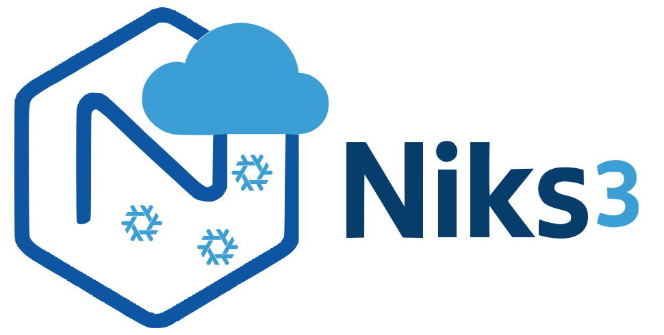
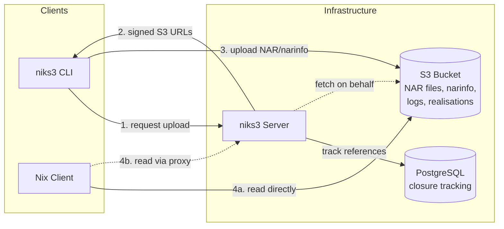

  

# S3-backed Nix binary cache with garbage collection

The idea is to have all reads be handled by the s3 cache (which itself can be high-available)
and have a gc server that tracks all uploads to the cache and runs periodic garbage collection on s3 cache.
Since writes to a binary cache are often not as critical as reads,
we can vastly simplify the operational complexity of the GC server, i.e. only
running one instance next to the CI infrastructure.

## Architecture

**Write path**: The niks3 CLI requests an upload from the server, which returns pre-signed S3 URLs.
The client uploads NAR files and narinfo directly to S3.
The server tracks references in PostgreSQL for garbage collection.

**Read path**: Nix clients read directly from S3 (or a CDN in front of it) without going through niks3.
This allows the read path to scale independently and remain highly available.

**Read proxy** (optional): For private S3 buckets, niks3 can proxy read requests
from Nix clients to S3 using its own credentials. Enable with `--enable-read-proxy`.
See the [Private S3 Buckets](https://github.com/Mic92/niks3/wiki/Private-S3-Buckets) wiki page.

## Features

### Binary Cache Protocol Support

niks3 implements the [Nix binary cache specification](https://nixos.org/manual/nix/stable/command-ref/new-cli/nix3-help-stores.html#s3-binary-cache-store) with the following features:

- **NAR files** (`nar/`): Compressed with zstd, stored in S3
- **Narinfo files** (`.narinfo`): Metadata with cryptographic signatures
  - StorePath, URL, Compression, NarHash, NarSize
  - FileHash, FileSize (for compressed NAR)
  - References, Deriver
  - Signatures (Sig fields)
  - CA field for content-addressed derivations
- **Build logs** (`log/`): Compressed build output storage
- **Realisation files** (`realisations/*.doi`): For content-addressed derivations
- **Cache info** (`nix-cache-info`): Automatic generation with WantMassQuery, Priority

### Advanced Features

- **Cryptographic signing**: NAR signatures using Ed25519 keys (compatible with `nix key generate-secret`)
- **Content-addressed derivations**: Full CA support with realisation info
- **Multipart uploads**: Efficient handling of large NARs (>100MB)
- **Transactional uploads**: Atomic closure uploads with rollback on failure
- **Garbage collection**: Reference-tracking GC with configurable retention
- **Parallel uploads**: Client parallelizes NAR and metadata uploads

### Operational Features

- Authentication via API tokens (Bearer auth)
- OIDC authentication for CI/CD systems (GitHub Actions, GitLab CI)
- S3 credentials via static keys (`--s3-access-key` / `--s3-secret-key`) or IAM (`--s3-use-iam` for IRSA, EC2 instance profiles, ECS task roles)

## Choosing an S3 Provider

niks3 works with any S3-compatible storage provider. We recommend **Cloudflare R2** for most users due to zero egress fees and excellent performance.

For detailed pricing comparison and alternative providers, see the [S3 Provider Comparison](https://github.com/Mic92/niks3/wiki/S3-Provider-Comparison) wiki page.

## Setup

For complete setup instructions, see the [Setup Guide](https://github.com/Mic92/niks3/wiki/Setup-Guide) in the wiki.

## OIDC Authentication (CI/CD)

niks3 supports OIDC authentication for CI/CD systems. See the wiki for details:

- [OIDC Configuration](https://github.com/Mic92/niks3/wiki/OIDC)
- [GitHub Actions](https://github.com/Mic92/niks3/wiki/GitHub-Actions)
- [GitLab CI](https://github.com/Mic92/niks3/wiki/GitLab-CI)

## Development

For development setup, database migrations, benchmarks, and contribution guidelines, see [CONTRIBUTING.md](CONTRIBUTING.md).

## Real-World Deployments

- **Clan infra**:
  [Configuration](https://git.clan.lol/clan/clan-infra/src/branch/main/modules/web01/niks3.nix)
  | [Instance](https://cache.clan.lol/)
- **Numtide**: [Instance](https://cache.numtide.com/)
- **TUM-DSE**:
  [Configuration](https://github.com/TUM-DSE/doctor-cluster-config)
  | [Instance](https://cache.dos.cit.tum.de/)

## Need commercial support or customization?

For commercial support, please contact [Mic92](https://github.com/Mic92/) at
joerg@thalheim.io or reach out to [Numtide](https://numtide.com/contact/).
